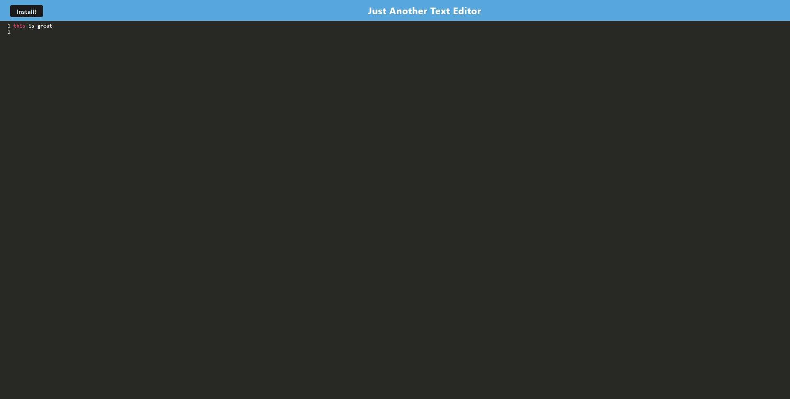

# JATE (Just Another Text Editor)

  ##Description
  
  - JATE allows notes or code snippets or unusually colored prose to be jotted down and and is accessible without internet internet access and can installed to one's local machine.
  
  ##Usage
  
  - Navigate to the website and start making notes. There's an install button at the top which will install JATE (it is a PWA) onto your desktop
  
  ##Credits
     [MarloweMich](https://github.com/MarloweMich)   [marlowemich@gmail.com](mailto:marlowemich@gmail.com)

  ##Features

  babel   y   html-webpack-plugin   http-server   indexedDB   
  
  ##How to Contribute 
  
  - Make a pull request to get involved"

  

  
  

  